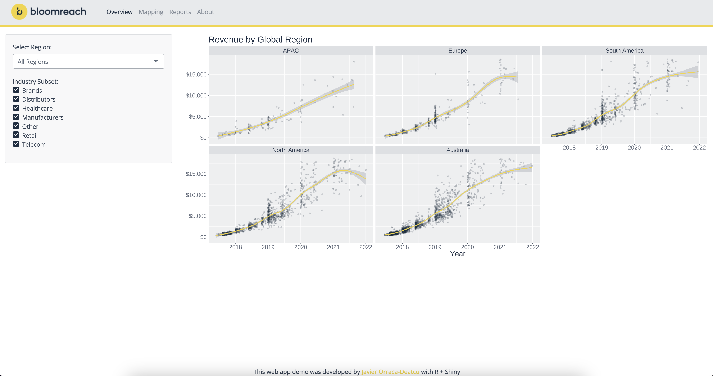

# Overview

This web app demo, hosted for free on Posit's [shinyapps.io](https://www.shinyapps.io/), relies on R's Shiny web framework, basic modules, the {bslib} package for styling Bootstrap themes with Sass variables, and {thematic} for styling {ggplot2} visualizations.

Live web app: [javierorraca.shinyapps.io/Bloomreach_Shiny_App](https://javierorraca.shinyapps.io/Bloomreach_Shiny_App)  
Step-by-Step Tutorial: [Build a Shiny App Demo as a Cover Letter Accessory](https://www.javierorracadeatcu.com/posts/2022-11-15-shiny-bslib-demo/2022-11-15-shiny-bslib-demo.html)

# About {bslib} and {thematic}

* [bslib](https://rstudio.github.io/bslib/)
  * {bslib} introduces Sass variables to Shiny making the customization process more unified and easier than the traditional _custom.css_
  * The default Bootstrap version for {bslib} is version 5, however, this app was designed using Bootstrap 4
* [thematic](https://rstudio.github.io/thematic/)
  * {thematic} provides a centralized approach to styling R graphics, particularly grubs and ggplot2 visualizations

# TLDR: Key Steps to Update for any Brand

* Configure color and font selections on `helpers/custom_theme.R`
* Change the navigation bar's brand logo appearance on `helpers/navbar.R`
  * The brand logo image should be stored in the `www/` folder and the image source file referenced on `helpers/navbar.R` (row 5) should be updated to the new logo file name
* For more advanced styling, please reference `www/styles.scss` to inspect additional Sassy CSS styling elements

